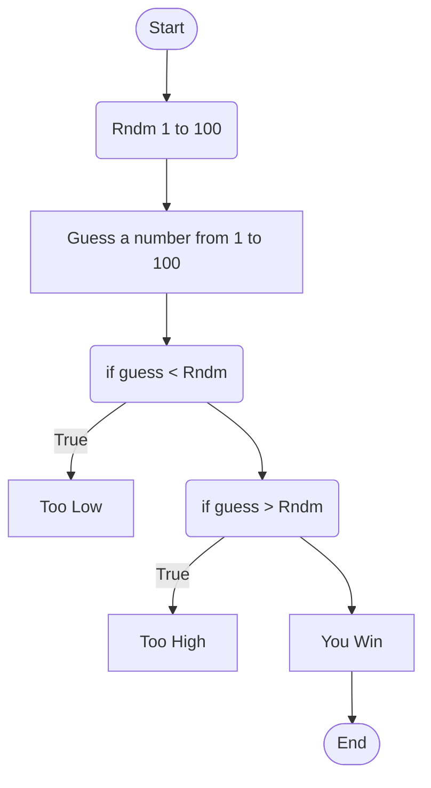

## Number Guessing Game

```mermaid
flowchart TD
Start([Start])-->Random("Rndm 1 to 100")
Random-->output["Guess a number from 1 to 100"]
output-->ifLess("if guess < Rndm")-- True -->outputA["Too Low"]
ifLess-->ifmore("if guess > Rndm")-- True -->outputB["Too High"]
ifmore-->outputC["You Win"]-->
End([End]) 
```
